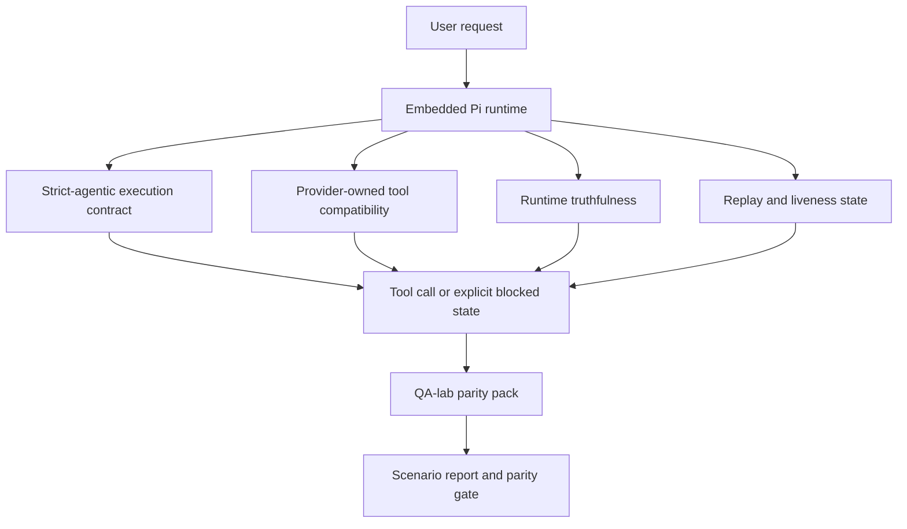

# GPT-5.4 / Codex Agentic Parity in OpenClaw

OpenClaw already worked well with tool-using frontier models, but GPT-5.4 and Codex-style models were still underperforming in a few practical ways:

- they could stop after planning instead of doing the work
- they could use strict OpenAI/Codex tool schemas incorrectly
- they could ask for `/elevated full` even when full access was impossible
- they could lose long-running task state during replay or compaction
- parity claims against Claude Opus 4.6 were based on anecdotes instead of repeatable scenarios

This parity program fixes those gaps in four reviewable slices.

## What changed

### PR A: strict-agentic execution

This slice adds an opt-in `strict-agentic` execution contract for embedded Pi GPT-5 runs.

When enabled, OpenClaw stops accepting plan-only turns as “good enough” completion. If the model only says what it intends to do and does not actually use tools or make progress, OpenClaw retries with an act-now steer and then fails closed with an explicit blocked state instead of silently ending the task.

This improves the GPT-5.4 experience most on:

- short “ok do it” follow-ups
- code tasks where the first step is obvious
- flows where `update_plan` should be progress tracking rather than filler text

### PR B: runtime truthfulness

This slice makes OpenClaw tell the truth about two things:

- why the provider/runtime call failed
- whether `/elevated full` is actually available

That means GPT-5.4 gets better runtime signals for missing scope, auth refresh failures, HTML 403 auth failures, proxy issues, DNS or timeout failures, and blocked full-access modes. The model is less likely to hallucinate the wrong remediation or keep asking for a permission mode the runtime cannot provide.

### PR C: execution correctness

This slice improves two kinds of correctness:

- provider-owned OpenAI/Codex tool-schema compatibility
- replay and long-task liveness surfacing

The tool-compat work reduces schema friction for strict OpenAI/Codex tool registration, especially around parameter-free tools and strict object-root expectations. The replay/liveness work makes long-running tasks more observable, so paused, blocked, and abandoned states are visible instead of disappearing into generic failure text.

### PR D: parity harness

This slice adds the first-wave QA-lab parity pack so GPT-5.4 and Opus 4.6 can be exercised through the same scenarios and compared using shared evidence.

The parity pack is the proof layer. It does not change runtime behavior by itself.

## Why this improves GPT-5.4 in practice

Before this work, GPT-5.4 on OpenClaw could feel less agentic than Opus in real coding sessions because the runtime tolerated behaviors that are especially harmful for GPT-5-style models:

- commentary-only turns
- schema friction around tools
- vague permission feedback
- silent replay or compaction breakage

The goal is not to make GPT-5.4 imitate Opus. The goal is to give GPT-5.4 a runtime contract that rewards real progress, supplies cleaner tool and permission semantics, and turns failure modes into explicit machine- and human-readable states.

That changes the user experience from:

- “the model had a good plan but stopped”

to:

- “the model either acted, or OpenClaw surfaced the exact reason it could not”

## Architecture

## Scenario pack

The first-wave parity pack currently covers four scenarios:

### `approval-turn-tool-followthrough`

Checks that the model does not stop at “I’ll do that” after a short approval. It should take the first concrete action in the same turn.

### `model-switch-tool-continuity`

Checks that tool-using work remains coherent across model/runtime switching boundaries instead of resetting into commentary or losing execution context.

### `source-docs-discovery-report`

Checks that the model can read source and docs, synthesize findings, and continue the task agentically rather than producing a thin summary and stopping early.

### `image-understanding-attachment`

Checks that mixed-mode tasks involving attachments remain actionable and do not collapse into vague narration.

## Release gate

GPT-5.4 can only be considered at parity or better when the merged runtime passes the parity pack and the runtime-truthfulness regressions at the same time.

Required outcomes:

- no plan-only stall when the next tool action is clear
- no fake completion without real execution
- no incorrect `/elevated full` guidance
- no silent replay or compaction abandonment
- parity-pack metrics that are at least as strong as the agreed Opus 4.6 baseline

## Who should enable `strict-agentic`

Use `strict-agentic` when:

- the agent is expected to act immediately when a next step is obvious
- GPT-5.4 or Codex-family models are the primary runtime
- you prefer explicit blocked states over “helpful” recap-only replies

Keep the default contract when:

- you want the existing looser behavior
- you are not using GPT-5-family models
- you are testing prompts rather than runtime enforcement
